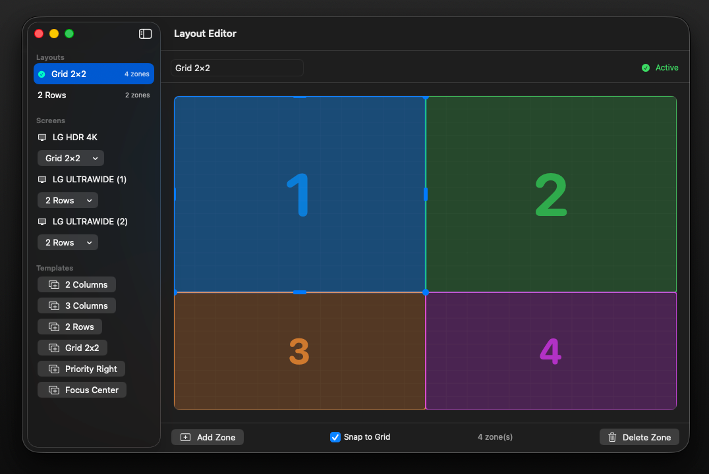
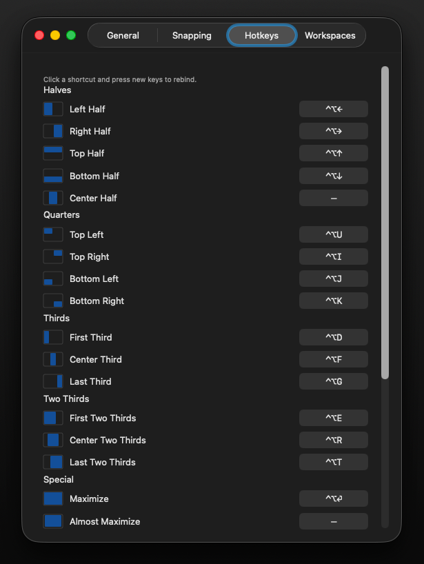

<p align="center">
  <h1 align="center">EpycZones</h1>
  <p align="center">
    <strong>FancyZones for macOS</strong> — A powerful window manager with custom zone layouts, drag-to-snap, and multi-monitor support.
  </p>
  <p align="center">
    <a href="https://github.com/ulissescomonian/EpycZones/releases/latest"></a>
    
    
    <a href="LICENSE"></a>
  </p>
</p>

---

EpycZones brings the best of Windows PowerToys [FancyZones](https://learn.microsoft.com/en-us/windows/powertoys/fancyzones) to macOS. Define custom screen zones, snap windows with keyboard shortcuts or Shift+Drag, and manage layouts across multiple monitors.

## Screenshots

<table>
  <tr>
    <td align="center"><strong>Layout Editor</strong></td>
    <td align="center"><strong>Customizable Hotkeys</strong></td>
    <td align="center"><strong>Menu Bar</strong></td>
  </tr>
  <tr>
    <td></td>
    <td></td>
    <td></td>
  </tr>
</table>

## Highlights

- **30+ snap positions** — Halves, quarters, thirds, two-thirds, fourths, sixths, and more
- **Shift + Drag** — Visual zone overlay with ghost preview of target position
- **Zone spanning** — Drag between two zones to snap across both at once
- **Visual layout editor** — Drag corners and edges to create any arrangement you need
- **Per-monitor layouts** — Different zones for each display
- **Fully customizable hotkeys** — Rebind every shortcut in Settings
- **Undo / Restore** — Return windows to their previous position
- **Workspaces** — Save and restore entire window arrangements
- **Lightweight** — Menu bar app, no Dock icon, ~1MB

## Installation

### Download

Download the latest [DMG from Releases](https://github.com/ulissescomonian/EpycZones/releases/latest), open it, and drag EpycZones to your Applications folder.

### Build from Source

```bash
git clone https://github.com/ulissescomonian/EpycZones.git
cd EpycZones
make bundle    # Build + create .app bundle
make run       # Build + run
```

Requires Xcode Command Line Tools and Swift 5.9+.

### First Launch

On first launch, macOS will ask for **Accessibility** permission. This is required to move and resize windows from other apps. Grant it in **System Settings > Privacy & Security > Accessibility**.

## Keyboard Shortcuts

All shortcuts use **⌃⌥** (Ctrl+Option) as the default modifier. Every shortcut is fully rebindable in **Settings > Hotkeys**.

### Halves

| Shortcut | Action |
|----------|--------|
| `⌃⌥ ←` | Left Half |
| `⌃⌥ →` | Right Half |
| `⌃⌥ ↑` | Top Half |
| `⌃⌥ ↓` | Bottom Half |

### Quarters

| Shortcut | Action |
|----------|--------|
| `⌃⌥ U` | Top Left |
| `⌃⌥ I` | Top Right |
| `⌃⌥ J` | Bottom Left |
| `⌃⌥ K` | Bottom Right |

### Thirds & Two-Thirds

| Shortcut | Action |
|----------|--------|
| `⌃⌥ D` | First Third |
| `⌃⌥ F` | Center Third |
| `⌃⌥ G` | Last Third |
| `⌃⌥ E` | First Two Thirds |
| `⌃⌥ R` | Center Two Thirds |
| `⌃⌥ T` | Last Two Thirds |

### Special & Navigation

| Shortcut | Action |
|----------|--------|
| `⌃⌥ Enter` | Maximize |
| `⌃⌥ H` | Maximize Height |
| `⌃⌥ C` | Center |
| `⌃⌥ -` | Make Smaller |
| `⌃⌥ =` | Make Larger |
| `⌃⌥ ⌫` | Restore previous position |
| `⌃⌥ N` | Next monitor |
| `⌃⌥ P` | Previous monitor |
| `⌃⌥ L` | Cycle layout |
| `⌃⌥ 1-9` | Snap to zone 1–9 |
| `Shift + Drag` | Drag to zone overlay |

Fourths and sixths are available as snap positions and can be assigned to custom shortcuts in Settings.

## Features in Detail

### Shift + Drag Snapping

Hold **Shift** while dragging any window to reveal the zone overlay. Move to a zone and release — the window snaps into place with a smooth animation. A ghost preview shows exactly where the window will land.

Drag near the **boundary between two zones** to span both at once. At the **center of four zones**, all four highlight for a fullscreen snap.

### Layout Editor

Create custom layouts visually. Each zone can be moved and resized freely with **8 handles** (4 corners + 4 edge midpoints). Toggle **Snap to Grid** for precise alignment or disable it for free-form editing.

Six built-in templates are included: 2 Columns, 3 Columns, 2 Rows, Grid 2×2, Priority Right, and Focus Center.

### Multi-Monitor

Assign a **different layout** to each connected display. Move windows between monitors with `⌃⌥N` / `⌃⌥P` — windows maintain their relative position and size when crossing screens.

### Settings

| Tab | What it does |
|-----|-------------|
| **General** | Launch at Login, animation toggle, overlay theme (Auto/Dark/Light) |
| **Snapping** | Zone gaps (0–20px), edge snap toggle with trigger distance and delay |
| **Hotkeys** | Visual preview + rebindable shortcut for every action |
| **Workspaces** | Save, restore, and manage complete window arrangements |

## How It Works

EpycZones runs as a **menu bar app** (no Dock icon). Under the hood:

| Component | Technology |
|-----------|-----------|
| Window control | Accessibility API (`AXUIElement`) |
| Drag detection | `NSEvent` global + local monitors |
| Keyboard shortcuts | Carbon `RegisterEventHotKey` |
| Zone overlay | `NSPanel` (transparent, floating) |
| Editor & Settings | SwiftUI |
| Persistence | JSON files + UserDefaults |

## Project Structure

```
Sources/EpycZones/
├── EpycZonesApp.swift          # Entry point + menu bar UI
├── AppDelegate.swift           # Lifecycle + permissions
├── AppSettings.swift           # User preferences
│
├── Zone.swift                  # Zone model (RelativeRect)
├── Layout.swift                # Layout model + 6 templates
├── LayoutStore.swift           # Persistence + per-screen mapping
├── SnapPosition.swift          # 30+ built-in positions
├── HotKeyBinding.swift         # Hotkey model + action registry
│
├── WindowManager.swift         # Move/resize via Accessibility API
├── WindowAnimator.swift        # Smooth easeOutCubic animation
├── WindowPersistence.swift     # Window → zone memory
├── WorkspaceManager.swift      # Save/restore workspaces
│
├── DragDetector.swift          # Shift+drag + edge snap
├── ZoneOverlayController.swift # Overlay panels + ghost preview
├── LayoutNotification.swift    # HUD notifications
│
├── HotKeyManager.swift         # Carbon hotkey registration
├── AccessibilityChecker.swift  # Permission handling
│
├── LayoutEditorView.swift      # Visual editor (SwiftUI)
├── ZoneCanvasView.swift        # Interactive canvas
└── SettingsView.swift          # 4-tab settings window
```

## Acknowledgments

Inspired by [FancyZones](https://learn.microsoft.com/en-us/windows/powertoys/fancyzones) from Microsoft PowerToys.

## License

[MIT License](LICENSE) — free to use, modify, and distribute.
